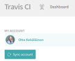
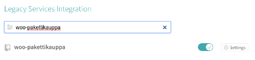
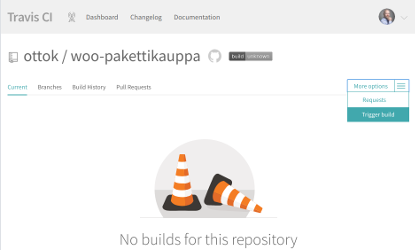

# Pakettikauppa WordPress plugin for WooCommerce

[](https://travis-ci.org/Seravo/woo-pakettikauppa) [](https://packagist.org/packages/seravo/woo-pakettikauppa) [](https://packagist.org/packages/seravo/woo-pakettikauppa) [](https://packagist.org/packages/seravo/woo-pakettikauppa) [](https://packagist.org/packages/seravo/woo-pakettikauppa)

# Maturity

> This software is now available for General Availability.

# Installation

This plugin can be installed via [WordPress.org plugin directory](https://wordpress.org/plugins/woo-pakettikauppa/), WP-CLI or Composer:

```sh
wp plugin install --activate woo-pakettikauppa
# OR
wp plugin install --activate https://github.com/Seravo/woo-pakettikauppa/archive/master.zip
# OR
composer require seravo/woo-pakettikauppa
```

The plugin requires WooCommerce >=3.4 to be installed, with shipping zones configured and this plugin activated and settings set.

Naturally the store owner also needs to have a merchant account at [Pakettikauppa](https://www.pakettikauppa.fi/).

> *Note!* If you already have shipping contracts with Posti, Matkahuolto or DB Schenker with reduced prices, you can contact the customer support of Pakettikauppa to get those contracts via Pakettikauppa so you can use the WooCommerce Pakettikauppa plugin with your current shipping contracts.

> *Important!* Before you start using this plugin, please check with your hosting provider that you have directory listing disabled. For more information about directory listing, check the documentation for [Apache](https://wiki.apache.org/httpd/DirectoryListings) or [Nginx](https://nginx.org/en/docs/http/ngx_http_autoindex_module.html).

# Features

* Integrates [Pakettikauppa](https://www.pakettikauppa.fi/) with WooCommerce
* Based on the official [Pakettikauppa API library](https://github.com/Pakettikauppa/api-library)
* Supports WooCommerce shipping zones (though Pakettikauppa is currently only available in Finland)
* Store owners can specify themselves any fixed rate for a shipping or have free shipping if the order value is above a certain limit
* Customers can choose to ship products to an address or to any pickup point available from the Pakettikauppa shipping methods
* Store owner can generate the shipping label in one click
* Store owners and customers get tracking code links and status information
* Test mode available that uses the testing API

# Screenshots


# Changelog

See git history.

# For developers

Pull requests are welcome!

Before submitting your patch, please make sure it is of high quality:

* Follow the [WordPress Codex plugin writing recommendations](https://codex.wordpress.org/Writing_a_Plugin) and also check the [WordPress Plugin Handbook](https://developer.wordpress.org/plugins/)
* Follow the specific [WooCommmerce plugin recommendations](https://docs.woocommerce.com/document/create-a-plugin/)
* Test the code on a clean WordPress/WooCommmerce installation with standard [dummy data](https://docs.woocommerce.com/document/importing-woocommerce-dummy-data/)
* Make sure the test suite passes locally and on Travis-CI
* Check that the code style is valid when tested with the phpcs.xml included in this project

## Developer docs

Please note that the official docs at https://docs.woocommerce.com/document/shipping-method-api/ contain partially outdated information. For more information, see wiki at https://github.com/woocommerce/woocommerce/wiki/Shipping-Method-API or dive directly into the source using [GitHub search](https://github.com/woocommerce/woocommerce/search?utf8=%E2%9C%93&q=extends+WC_Shipping_Method&type=) to find up-to-date examples on how to extend the shipping method class.

## Travis CI and automatic testing

This project has a `.travis-ci.yml` definition which can be used by anybody. Just follow these steps:
1. Create an account at [Travis-CI.org](https://travis-ci.org/) by logging in with your Github.com account.
2. Make sure you have a fork of this repository in your own Github.com account.
3. Open the [Travis-CI.org settings page](https://travis-ci.org/account/repositories) and click "Sync repositories"

4. Search for `woo-pakettikauppa` in your repository list and enable automatic testing for the repository it.

5. Initially the page `https://travis-ci.org/<username>/woo-pakettikauppa` will be empty, but as soon as you push your first commit Travis-CI will run the first built. You can also manually trigger a build to get it started.


## Running tests locally

You can run the tests locally with by using the install-tests.sh & run-tests.sh. Note that these scripts are **destructive**, so you should probably run them in a virtual environment such as Vagrant or Docker. Assuming you're using [Seravo/wordpress](https://github.com/Seravo/wordpress):

```
docker-compose exec wordpress bash
cd /data/wordpress/htdocs/wp-content/plugins/woo-pakettikauppa/bin

# do not run ./install-wp-tests.sh yourself
./install-local-tests.sh
./run-local-tests.sh
```

You may need to chmod the scripts before using: `chmod +x install-tests.sh`

## Architecture
The plugin is written so that it can be easily forked to a whitelabel version, containing only a subset of shipping providers and a custom branding. This is achieved by using an abstract class as a factory for the plugin component. Each component can be replaced by simply overloading a method.

The `Woo_Pakettikauppa_Core\Core` class is responsible for loading all components, and it serves as a bridge between the components. The instance is passed to most subclasses of the plugin, such as `Woo_Pakettikauppa_Core\Admin`, which keep a reference to it under `$this->core`.

The subclasses are responsible for doing the actual heavy lifting. `Admin` handles operations in wp-admin, `Frontend` handles frontend, `Shipment` is used for creating shipment labels, etc.

`Text` is bit of a special case, it's only real purpose is to serve as a key-value store for strings that require translation. Currently the plugin has __ & _e calls scattered all over it, in the future, all of them should live in `Text`. The advantage of doing so is being able to replace any text in the whitelabel forks.
