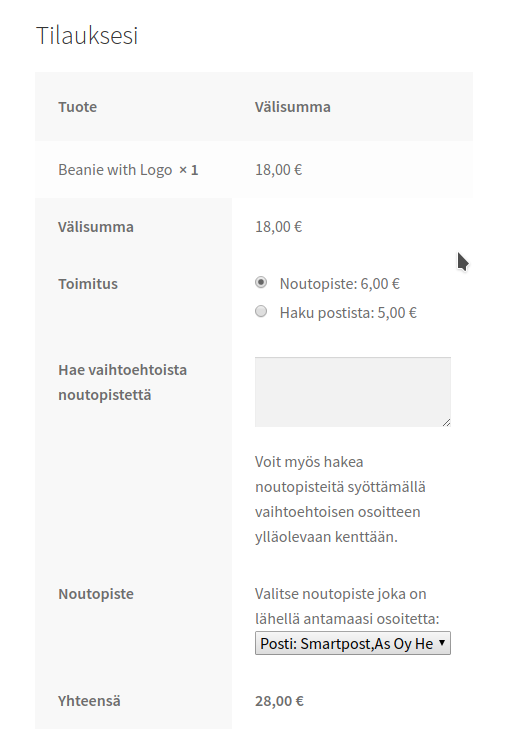
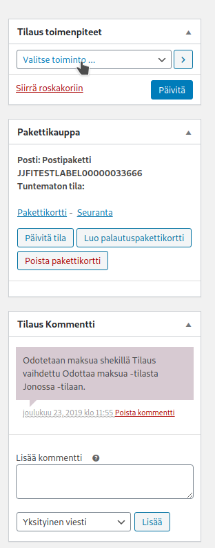
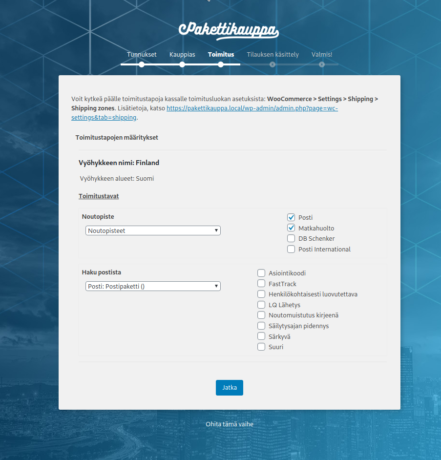

# Pakettikauppa WordPress plugin for WooCommerce

[](https://travis-ci.org/Seravo/woo-pakettikauppa) [](https://packagist.org/packages/seravo/woo-pakettikauppa) [](https://packagist.org/packages/seravo/woo-pakettikauppa) [](https://packagist.org/packages/seravo/woo-pakettikauppa) [](https://packagist.org/packages/seravo/woo-pakettikauppa)

# Maturity

> This software is now available for General Availability.

# Installation

This plugin can be installed via [WordPress.org plugin directory](https://wordpress.org/plugins/woo-pakettikauppa/), WP-CLI or Composer:

```sh
wp plugin install --activate woo-pakettikauppa
# OR
wp plugin install --activate https://github.com/Seravo/woo-pakettikauppa/archive/master.zip
# OR
composer require seravo/woo-pakettikauppa
```

The plugin requires WooCommerce >=3.4 to be installed, with shipping zones configured and this plugin activated and settings set.

Naturally the store owner also needs to have a merchant account at [Pakettikauppa](https://www.pakettikauppa.fi/).

> *Note!* If you already have shipping contracts with Posti, Matkahuolto or DB Schenker with reduced prices, you can contact the customer support of Pakettikauppa to get those contracts via Pakettikauppa so you can use the WooCommerce Pakettikauppa plugin with your current shipping contracts.

> *Important!* Before you start using this plugin, please check with your hosting provider that you have directory listing disabled. For more information about directory listing, check the documentation for [Apache](https://wiki.apache.org/httpd/DirectoryListings) or [Nginx](https://nginx.org/en/docs/http/ngx_http_autoindex_module.html).

# Features

* Integrates [Pakettikauppa](https://www.pakettikauppa.fi/) with WooCommerce
* Based on the official [Pakettikauppa API library](https://github.com/Pakettikauppa/api-library)
* Supports WooCommerce shipping zones (though Pakettikauppa is currently only available in Finland)
* Store owners can specify themselves any fixed rate for a shipping or have free shipping if the order value is above a certain limit
* Customers can choose to ship products to an address or to any pickup point available from the Pakettikauppa shipping methods
* Store owner can generate the shipping label in one click
* Store owners and customers get tracking code links and status information
* Test mode available that uses the testing API

# Screenshots






# Changelog

See git history.

# For developers

Pull requests are welcome!

Before submitting your patch, please make sure it is of high quality:

* Follow the [WordPress Codex plugin writing recommendations](https://codex.wordpress.org/Writing_a_Plugin) and also check the [WordPress Plugin Handbook](https://developer.wordpress.org/plugins/)
* Follow the specific [WooCommmerce plugin recommendations](https://docs.woocommerce.com/document/create-a-plugin/)
* Test the code on a clean WordPress/WooCommmerce installation with standard [dummy data](https://docs.woocommerce.com/document/importing-woocommerce-dummy-data/)
* Make sure the test suite passes locally and on Travis-CI
* Check that the code style is valid when tested with the phpcs.xml included in this project

## Developer docs

Please note that the official docs at https://docs.woocommerce.com/document/shipping-method-api/ contain partially outdated information. For more information, see wiki at https://github.com/woocommerce/woocommerce/wiki/Shipping-Method-API or dive directly into the source using [GitHub search](https://github.com/woocommerce/woocommerce/search?utf8=%E2%9C%93&q=extends+WC_Shipping_Method&type=) to find up-to-date examples on how to extend the shipping method class.

## Running a local development environment

To develop woo-pakettikauppa (or any WordPress plugin) you need to have a running WordPress installation. If you want to use [Seravo/WordPress](https://github.com/Seravo/wordpress) as a local development environment clone it to your computer and fire it up in Vagrant or Docker following its instructions. Once done, you will have a clean and pretty empty WordPress site.

Assuming you have the local development environment running in directory `wordpress` and this plugin is checked out next to it, you can use [entr](http://eradman.com/entrproject/) and [rsync](https://rsync.samba.org/) to automatically sync the `woo-pakettikauppa` contents into the local development environment:

```
find * | entr rsync -vr . ../wordpress/htdocs/wp-content/plugins/woo-pakettikauppa | ts
```

This is handy, as no matter what happens to the local development environment the git checkout of `woo-pakettikauppa` is always protected from harm and you can have your text editor and git tools running in that directory always in the same way.

### Running tests in local development environment

There are preconfigured phpcs.xml and phpunit.xml files in the project, so running tests is very easy:

```
vagrant$ cd /data/wordpress/htdocs/wp-content/plugins/woo-pakettikauppa/
vagrant$ phpcs
vagrant$ phpunit --verbose
```

Note that the phpcs and phpunit versions in the local development version might differ from the versions used in the CI system and thus produce different results.

## Travis CI and automatic testing

This project has a `.travis-ci.yml` definition which can be used by anybody. Just follow these steps:
1. Create an account at [Travis-CI.org](https://travis-ci.org/) by logging in with your Github.com account.
2. Make sure you have a fork of this repository in your own Github.com account.
3. Open the [Travis-CI.org settings page](https://travis-ci.org/account/repositories) and click "Sync repositories"

4. Search for `woo-pakettikauppa` in your repository list and enable automatic testing for the repository it.

5. Initially the page `https://travis-ci.org/<username>/woo-pakettikauppa` will be empty, but as soon as you push your first commit Travis-CI will run the first built. You can also manually trigger a build to get it started.


### Debugging failed Travis CI jobs

First read carefully all the output of the failed jobs. Most of the time the reason to the failure is clearly stated.

You can also simulate the tests Travis CI runs by running inside the local development environment the same commands that [.travis.yml](.travis.yml) runs:

```
vagrant$ cd /data/wordpress/htdocs/wp-content/plugins/woo-pakettikauppa/
vagrant$ SNIFF=1 ./tests/install-tests.sh
vagrant$ SNIFF=1 ./tests/run-tests.sh
```

To control what tests are run by setting variables like 'SNIFF' and others. See [.travis.yml](.travis.yml) for all options used in current matrix.

Travis CI has published [travis-build](https://github.com/travis-ci/travis-build) for converting the `.travis.yml` file into a `.sh` script you can run if you feel adventurous. They also offer a [debug build mode](https://docs.travis-ci.com/user/running-build-in-debug-mode/) that can be used to debug failed builds via SSH directly on Travis' servers.

## Translating

If you add new translatable strings or edit existing once, you have to regenerate `woo-pakettikauppa.pot` under `core/languages`. Easiest way to do it is use wp-cli:

```
wp i18n make-pot . core/languages/woo-pakettikauppa.pot
```

## Branching and releases

### Development always targets master branch

All bugfixes and new features are developed on separate git branches. Work-in-progress can be marked by appending "WIP:" to the commit message or the pull request title. Once a feature is ready, a pull request is opened for comments and review. Pull requests should not include any updates to the changelog or version number, as those are done separately at release time to match the actual release. Making a pull request implies that comments and review are requested, so wait at least 24h after making a new PR so others have time to respond.

Very small bugfixes that don't need any reviews (e.g. fixing spelling errors) can be applied directly on master. Note that all commits must pass CI, so Travis-CI needs to see a commit on some branch first and Github needs to register that commit as passing CI. Then those commits can be merged directly on master by a developer who has write access to master, without making a separate pull request on Github.

As this is a WordPress plugin, there can only be one version released. Thus there are no separate maintenance release branches (once 2.1.x has been released, the next release must be 2.1.y or higher, there cannot be any maintenance releases for 2.0.x).

### Making a new release

All improvements on land on master, and when the current master is tested and deemed fit for a release, the release itself include:

- Make a temporary branch where you bump the version number and update the changelog, ensure CI passes
- Send an email to asiakaspalvelu@pakettikauppa.fi as a heads-up about the upcoming release
- Wait for 1-2 work days
- Merge the temporary branch on master and tag it using git (don't use Github's release features, it can mess up the git tag references)
- This repository hooks into https://deployer.seravo.com/, Packagist and all release actions happen automatically based on the git tag

## Architecture

The plugin is written so that it can be easily forked to a whitelabel version, containing only a subset of shipping providers and a custom branding. This is achieved by using an abstract class as a factory for the plugin component. Each component can be replaced by simply overloading a method.

The `Woo_Pakettikauppa_Core\Core` class is responsible for loading all components, and it serves as a bridge between the components. The instance is passed to most subclasses of the plugin, such as `Woo_Pakettikauppa_Core\Admin`, which keep a reference to it under `$this->core`.

The subclasses are responsible for doing the actual heavy lifting. `Admin` handles operations in wp-admin, `Frontend` handles frontend, `Shipment` is used for creating shipment labels, etc.

`Text` is bit of a special case, it's only real purpose is to serve as a key-value store for strings that require translation. Currently the plugin has `__` and `_e` calls scattered all over it – in the future, all of them should live in `Text`. The advantage of doing so is being able to replace any text in the whitelabel forks.
